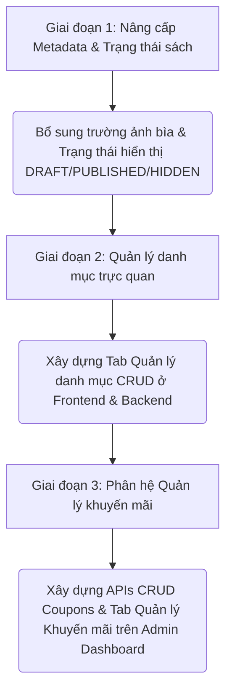

# BẢN PHÂN TÍCH CHUYÊN SÂU: ACTOR PRODUCT MANAGER (QUẢN LÝ SẢN PHẨM)
*Smart Digital Library (SDL) - Đối chiếu Sơ đồ Use Case & Tiêu chuẩn Thị trường*

Tài liệu này đánh giá hiện trạng phát triển các tính năng dành cho **Product Manager (Trình quản lý sản phẩm / Curator)** trong hệ thống Smart Digital Library (SDL), so sánh với sơ đồ Use Case yêu cầu và các sản phẩm thương mại điện tử / nhà sách điện tử hàng đầu trên thị trường hiện nay (Shopee, Tiki, Fahasa, Waka).

---

## 1. ĐỐI CHIẾU SƠ ĐỒ USE CASE (YÊU CẦU VS. THỰC TẾ)

Dựa trên sơ đồ Use Case của bạn, vai trò **Product Manager** liên kết trực tiếp với 4 nhóm tính năng chính. Dưới đây là bảng đối chiếu chi tiết giữa thiết kế và những gì hệ thống đã/chưa làm được:

| Các Use Case chính | Trạng thái Backend | Trạng thái Frontend | Nội dung đã thực hiện | Thiếu sót & Khoảng trống lớn |
| :--- | :---: | :---: | :--- | :--- |
| **1. Quản lý danh mục** | `Có một phần` | `Chưa có` | - Model `Category.js` hỗ trợ đầy đủ các hàm truy vấn DB (`getAll`, `findById`, `create`, `delete`).  - API Route chỉ cung cấp `GET /categories` và `POST /categories`. | - Thiếu API cập nhật danh mục (`PUT`) và xóa danh mục (`DELETE`).  - **Chưa có giao diện (tab) quản trị danh mục** trên Admin Dashboard (mới chỉ cho phép chọn danh mục qua checkbox khi thêm/sửa sách). |
| **2. Quản lý thông tin sách** | `Đầy đủ` | `Đầy đủ` | - Hỗ trợ CRUD sách đầy đủ (`GET`, `POST`, `PUT`, `DELETE`).  - Quản lý quan hệ nhiều-nhiều với danh mục qua bảng trung gian `book_categories`. | - Trường thông tin sách còn tối giản (chỉ có Tên, Tác giả, ISBN, Mô tả, Giá).  - Thiếu trường lưu trữ Ảnh bìa sách riêng biệt (đang dùng ảnh placeholder tĩnh hoặc sinh tự động). |
| **3. Quản lý trạng thái hiển thị** | `Chưa có` | `Chưa có` | - Chưa lưu trữ hay xử lý trạng thái hiển thị nào của sách. | - Thiếu cột trạng thái (Ví dụ: `status` hoặc `is_visible` với các giá trị `DRAFT` / `PUBLISHED` / `HIDDEN` trong DB).  - Sách khi tạo xong lập tức hiển thị công khai trên Storefront. |
| **4. Quản lý khuyến mãi** | `Có một phần` | `Chưa có` | - Database có cấu trúc bảng `coupons` và `user_coupons`.  - Đã tích hợp API `GET /api/coupons/validate` ở luồng Checkout của Khách hàng. | - **Hoàn toàn chưa có API quản trị** (chưa có route tạo, cập nhật, xóa coupon).  - **Chưa có giao diện (UI)** để Product Manager quản lý danh sách khuyến mãi (hiện tại phải insert thủ công vào DB). |

---

## 2. PHÂN TÍCH CHI TIẾT & SO SÁNH VỚI TIÊU CHUẨN THỊ TRƯỜNG

Khi đặt Smart Digital Library (SDL) cạnh các nền tảng sách lớn (Tiki, Fahasa, Shopee, Waka), chúng ta thấy rõ các khoảng cách công nghệ và vận hành như sau:

### A. Quản lý danh mục (Category Management)
* **Thực trạng SDL:** Danh mục sách mới chỉ đóng vai trò phân loại tĩnh. Người quản lý sản phẩm không thể quản lý danh sách này (thêm mới, sửa tên, xóa) trực tiếp từ giao diện Admin. Khi tạo/sửa sách, họ chỉ được tick chọn các danh mục đã có sẵn trong cơ sở dữ liệu.
* **Tiêu chuẩn thị trường (Shopee, Tiki):**
  - Hỗ trợ **Danh mục đa tầng (Nested/Multi-level Categories)**: Sách -> Sách Ngoại Văn -> Sách Khoa Học Kinh Tế.
  - Giao diện Admin chuyên nghiệp cho phép CRUD danh mục, thay đổi vị trí hiển thị, tải lên icon danh mục, và đặc biệt là xử lý ràng buộc khi xóa (nếu xóa danh mục cha thì danh mục con/sách trong đó sẽ chuyển về danh mục mặc định hoặc bị gỡ bỏ danh mục).

### B. Quản lý thông tin sách (Book Metadata Management)
* **Thực trạng SDL:** Tính năng CRUD sách hoạt động tốt tại tab `QUẢN LÝ SÁCH` trên Admin Dashboard. Tuy nhiên, metadata của sách còn rất đơn giản, không đủ để tạo ra một trang chi tiết sách thuyết phục độc giả.
* **Tiêu chuẩn thị trường (Fahasa, Tiki):**
  - **Thông tin thư tịch chuyên sâu:** Hỗ trợ lưu trữ các trường đặc thù như: *Nhà xuất bản, Nhà phát hành, Năm xuất bản, Số trang, Ngôn ngữ, Loại bìa (Cứng/Mềm), Kích thước, Trọng lượng*.
  - **Hình ảnh & Multimedia:** Cho phép đăng tải bộ sưu tập ảnh (Gallery), video giới thiệu sách hoặc chương đọc thử PDF.
  - **Upload ảnh bìa thực tế:** Có trường upload ảnh bìa lên kho lưu trữ (Cloudinary, S3...) hoặc lưu trữ trực tiếp thay vì chỉ sử dụng ảnh mặc định.

### C. Quản lý trạng thái hiển thị (Display Status Management)
* **Thực trạng SDL:** Tính năng này hoàn toàn bị bỏ trống. Khi sách được tạo ra, nó sẽ xuất hiện ngay trên trang chủ.
* **Tiêu chuẩn thị trường (Shopee, Lazada):**
  - Quy trình quản lý trạng thái sản phẩm gồm 3 bước tiêu chuẩn:
    1. **Bản nháp (Draft):** Đang biên tập thông tin sách, lưu tạm, chưa hiển thị ra ngoài.
    2. **Đang bán/Công khai (Published/Active):** Hiển thị công khai để khách hàng mua/đọc.
    3. **Ẩn/Ngưng bán (Hidden/Archived):** Tạm thời ẩn khỏi Storefront khi hết hàng hoặc ngừng phát hành, nhưng dữ liệu sách vẫn phải giữ lại trong DB để tránh lỗi khóa ngoại đối với các đơn hàng cũ đã thanh toán.
  - *SDL Hiện tại:* Khi muốn dừng bán chỉ có thể dùng lệnh xóa cứng (Hard Delete). Điều này rất nguy hiểm vì sẽ gây lỗi tính toàn vẹn dữ liệu nếu cuốn sách đó đã tồn tại trong lịch sử mua hàng của người dùng.

### D. Quản lý khuyến mãi (Promotion/Coupon Management)
* **Thực trạng SDL:** Khách hàng có thể áp dụng coupon khi thanh toán, nhưng Product Manager hoàn toàn không có công cụ nào trên Web để cấu hình coupon. 
* **Tiêu chuẩn thị trường (Tiki, Shopee):**
  - Hệ thống khuyến mãi linh hoạt cho phép thiết lập:
    - Loại coupon: Giảm theo số tiền tuyệt đối (đ) hoặc theo tỷ lệ phần trăm (%).
    - Điều kiện áp dụng: Giá trị đơn hàng tối thiểu, giới hạn tổng số lượng sử dụng, giới hạn lượt dùng trên mỗi tài khoản.
    - Thời gian hiệu lực: Ngày bắt đầu và ngày kết thúc chiến dịch.
    - Quản lý trạng thái coupon: Đang hoạt động, Đã hết hạn, Đã hết lượt sử dụng, Tạm dừng.

---

## 3. KỊCH BẢN ĐỀ XUẤT NÂNG CẤP (ACTION PLAN)

Để hoàn thiện đầy đủ vai trò của **Product Manager**, chúng tôi đề xuất kế hoạch triển khai bổ sung các tính năng này theo trình tự ưu tiên sau:

### Bước 1: Bổ sung trường Ảnh bìa & Trạng thái hiển thị sách (Ưu tiên Cao)
* **Backend:**
  - Thêm cột `cover_url` và `status` (`DRAFT`, `PUBLISHED`, `HIDDEN`) vào bảng `books`.
  - Cập nhật API GET sách ngoài Storefront: Chỉ lấy các sách có trạng thái là `PUBLISHED`.
* **Frontend:**
  - Bổ sung ô nhập link ảnh bìa và dropdown chọn Trạng thái (`Bản nháp`, `Công khai`, `Ẩn`) trong Modal Thêm/Sửa sách.
  - Hiển thị badge trạng thái sách trực quan trên danh sách quản lý.

### Bước 2: Xây dựng tab quản lý "Danh mục" (Ưu tiên Trung bình)
* **Backend:** Bổ sung API `PUT /api/categories/:id` và `DELETE /api/categories/:id` kèm theo kiểm tra ràng buộc (nếu xóa danh mục, xóa liên kết trong bảng `book_categories`).
* **Frontend:** Tạo tab **QUẢN LÝ DANH MỤC** phẳng trên Admin Dashboard cho phép Xem, Thêm, Sửa, Xóa danh mục nhanh chóng.

### Bước 3: Hoàn thiện phân hệ quản lý "Khuyến mãi" (Ưu tiên Cao - do liên quan mật thiết đến luồng mua hàng)
* **Backend:** Viết các API CRUD Coupon dành riêng cho Admin/Curator:
  - `GET /api/admin/coupons` (Lấy danh sách tất cả các coupon).
  - `POST /api/admin/coupons` (Tạo coupon mới).
  - `PUT /api/admin/coupons/:id` (Cập nhật coupon).
  - `DELETE /api/admin/coupons/:id` (Xóa coupon).
* **Frontend:** Thêm tab **MÃ GIẢM GIÁ (COUPONS)** trên Admin Dashboard, hiển thị danh sách coupon dưới dạng bảng, có nút Tạo mới (nhập mã, giá trị giảm, giá trị đơn tối thiểu, ngày bắt đầu/kết thúc) và nút Vô hiệu hóa coupon.
